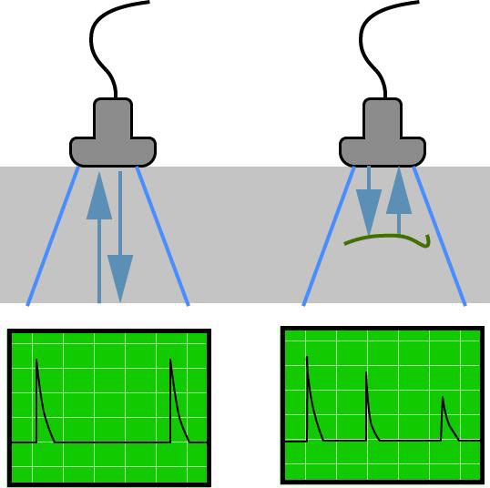

# Ultrasound NDT Flaw Detector

## Description

 

Non-destructive testing (NDT) is a method to inspect materials without causing damage. This software simulates \*\*ultrasound pulse-echo testing\*\* to detect defects (cracks, voids) inside materials.

When an ultrasound pulse is sent into a material, it reflects from any defect. By measuring:

- \*\*Echo time\*\* → we calculate defect depth

\- \*\*Echo amplitude\*\* → we estimate defect size

## Physics Background

### Time of Flight

The echo returns after traveling to the defect and back:

t = 2 × d / v

where:

\- t = echo time (seconds)

\- d = defect depth (meters)

\- v = sound velocity in material (m/s)

### Attenuation

As ultrasound travels, its amplitude decreases exponentially:

A = A0 × exp(-α × d)

where α is the attenuation coefficient.

## Project Structure

| File | Description |
|------|-------------|
| ultrasound.py | Core physics functions |
| simulation.py | Runs the simulation |
| plots.py | Creates graphs |
| testing.py | Unit tests |
| configuration.txt | User parameters |

## How to Run

### 1. Install dependencies

pip install numpy matplotlib pytest

### 2. Run simulation

python simulation.py configuration.txt

### 3. Generate plots

python plots.py configuration.txt

### 4. Run tests

python testing.py

## Results

The simulation produces three plots:

\- Echo time vs depth (linear relationship)

\- Echo amplitude vs depth (exponential decay)

\- Sample A-scan showing initial pulse and defect echo

## File Descriptions

| File | Description |
|------|-------------|
| `ultrasound.py` | Pure physics functions |
| `simulation.py` | Runs simulation for multiple depths |
| `plots.py` | Creates publication-ready plots |
| `testing.py` | Unit tests for all core functions |
| `configuration.txt` | Parameters read by configparser |

## Author

Issam Azrouisghi

Software and Computing for Applied Physics - University of Bologna

